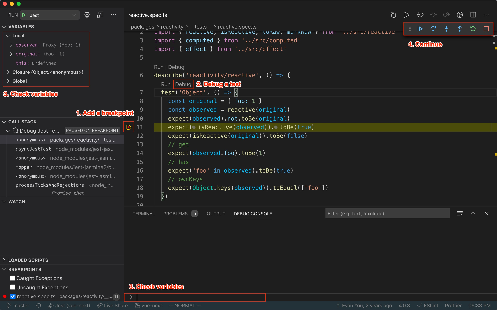

# Read Vue 3 Source Code

This is the repository to document what and how I learn Vue 3 source code.

  - [How to Read Source Code](#how-to-read-source-code)
    - [Debug from example app](#debug-from-example-app)
      - [Step 1: create sourcemap](#step-1-create-sourcemap)
      - [Step 2: create an example app](#step-2-create-an-example-app)
    - [Debug from test](#debug-from-test)
      - [Step 1: install dependencies](#step-1-install-dependencies)
      - [Step 2: run test and start debugging](#step-2-run-test-and-start-debugging)
  - [Progress](#progress)

## How to Read Source Code

The best way to read source code is to **try it yourself** through two ways:

- [Debug from example app](#debug-from-example-app)
- [Debug from test](#debug-from-test)

Before we start, clone [Vue 3](https://github.com/vuejs/vue-next) source code to your local.

```
git clone https://github.com/vuejs/vue-next.git
```

### Debug from example app

This is more intuitive way and closer to a real app.

If you want to have a quick start (30 seconds) instead of compiling yourself (5 minutes),  simply fork and clone this repo, then open `src/main.html`. Otherwise:

#### Step 1: create sourcemap

Create `sourcemap` so that the example html could have reference to.

```bash
yarn build -s
```

#### Step 2: create an example app

Create an example `main.html` in the root directory and open in browser to start debugging.

```html
<html>
  <head>
    <script src="./packages/vue/dist/vue.global.js"></script>
  </head>
  <body>
    <div id="app"></div>
    <script>
      console.log(Vue)
      const ref = Vue.ref
      const App = {
        template: `
          <div>Count: {{ count }}</div>
          <button @click="increment">Increment</button>
        `,
        setup () {
          const count = ref(0)
          function increment() {
            count.value += 1
          }
          return { count, increment }
        }
      }
      let vm = Vue.createApp(App).mount('#app')
      console.log(vm)
    </script>
  </body>
</html>
```

### Debug from test

The other way to read through source code is from test.

#### Step 1: install dependencies

Use `yarn` to install dependencies before you could run tests and start debugging.

```bash
#  Run yarn in vue-next repo
# `brew install yarn` if you don't have it installed or go to https://classic.yarnpkg.com/en/docs/install#mac-stable for more instructions.
yarn install
```

#### Step 2: run test and start debugging

If we are interested in for example, how `reactivity` works, which is covered by `packages/reactivity/__tests__/reactive.spec.ts`, you could:

**Option 1: VSCode (Recommend)**

Add a breakpoint at the target line in VSCode and click `Debug`:



This is more interactive than running from command line and could save you a lot of time.

**Option 2: Command Line**

Run:

```bash
# Use reactivity.spec.ts as an example
npm run test packages/reactivity/__tests__/reactive.spec.ts
```

## Progress

This is a list of topics from [Vue 3](https://github.com/vuejs/vue-next/tree/master/packages) that will be covered in this repo, and more topics will be added later.

Once a topic is covered in this list, it will be checked and showed as a link.

- [ ] reactivity
  - [ ] computed
  - [ ] effect
  - [ ] reactive
  - [ ] ref
- [ ] runtime-core
  - [ ] apiCreateApp
  - [ ] h
  - [ ] renderer
  - [ ] vnode
- [ ] runtime-dom
  - [ ] vModel
  - [ ] vOn
  - [ ] vShow
  - [ ] nodeOpts
- [ ] compiler-core
- [ ] compiler-dom
